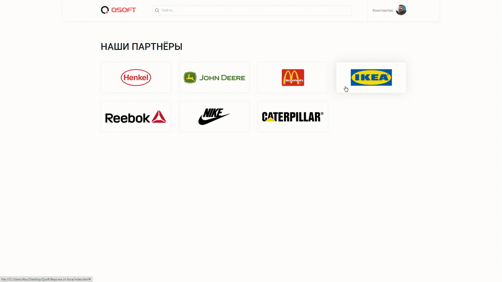

# Qsoft-Partners 
> Promo site with responsive flexbox, animated box shadow
> 
<a href="https://username1111111111.github.io/Qsoft-Partners/">Live demo here</a>

> 
Or 👇:

## Table of Contents
* [General Info](#general-information)
* [Technologies Used](#technologies-used)
* [Features](#features)
* [Screenshots](#screenshots)
* [Usage](#usage)
* [Contact](#contact)

## General Information
- This was done as a test for markup layout skills
- It was a good practice with flexbox, responsive cross-browser layout, pixel perfect 

## Technologies Used
- SCSS
- Flexbox
- Google fonts

## Features
- Responsive
- Cross-browser
- Pixel-perfect

## Screenshots

## Usage
Just clone the repo and open **index.html** in a browser 👍

## Contact

<a style="text-decoration: none;"href="https://github.com/Username1111111111/Username1111111111">@Username1111111111</a>
 
  
The Frontend developer 

    💪

